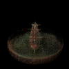

# NeRF - Neural Radiance Fields  

This repository contains a Pytorch implementation of the Neural Radiance Fields (NeRF) algorithm from scratch as described in the paper ["NeRF: Representing Scenes as Neural Radiance Fields for View Synthesis"](https://arxiv.org/pdf/2003.08934.pdf).

* **Volumetric** representation of a scene as **weights** of Neural Network.
* For each **point** in space the NeRF represents a **view dependent radiance**.
* Inputs:
    * (x, y, z): 3D point **location**.
    * (i, j, k): viewing **direction**.
* Outputs:
    * density: how **transparent** or opaque.
    * (r, g, b): view dependent **color** that changes depending on the **angle** the point is viewed.
* Can render from **novel viewpoints**. 
* Representation is optimized from a set of **images** and **camera poses**.
* **Pixel-Level** neural network.
* Highly **memory-efficient** 3D representation/**data-type**.
* **Sinusoidal** High Dimensional **positional embedding**.
* Limitations: 
    * cannot handle **dynamic** scenes.
    * won't generalize to **new objects**.
    * scene appearance should constant (ie. exposure doesn’t change).
* NeRF Image Rendering Pseudo Code:
    ```python
    for u in range(0, width):
        for v in range(0, height):
            origin, direction = get_ray(intrinsic, extrinsic/pose, u, v)
            samples = sample(near, far, num_coarse_samples)  # uniform, pdf sampler, ...
            xyzs = origin + direction*samples  # [num_coarse_sample, 3]
            densites, colors = neural_net(xyzs, direction)
            rgb, pdf = volume_render(samples, densities, colors)
            image[v, u] = rgb
    ```
* Volume Rendering Pseudo Code:
    ```python
    def volume_render(samples, densities, colors)
        distances_bn_samples = samples[1:] - samples[:-1]
        
        opacity = densities[:-1]*distances_bn_samples
        transmittances = [1, *exp(-cumsum(opacity))]
        alphas = 1 - [*exp(-opacity), exp(-densities[-1]*(far_planes - samples[-1]))]
        
        weights = transmittances*alphas
        rgb = sum(weights*colors)
        pdf = weights/(norm(weight)+ 1e-6)
        
        return rgb, pdf
    ```

# Dependencies
* python 3
* pytorch 1.9 or higher
* open3d 0.16.0 (Optional)

# Requirements
```pip install -r requirements.txt```

# Dataset
To train and test the NeRF model, you will need a dataset of **images** and corresponding **camera poses**. So download the **nerf-sythetic** dataset from the links provided here https://www.matthewtancik.com/nerf.

# Usage

* Create config.py file with proper parameters. Refer example config - [config/ship.py](./config/ship.py)
* To train the NeRF model, run the following command:
    ```python train.py path/to/config.py```
* To sample/visualize results, refer [demo.py](./demo.py) and edit it with proper chekpoint and output directory path. Then run the following command:
    ```python demo.py```
* To visualize/understand volume rendering on voxel grid, run the notebook [voxel_volume_rendeing.ipynb](./voxel_volume_rendering.ipynb)

# Results
* **Sampled** views from **NeRF** optimized on **nerf-sythetic** blender **ship** dataset for **30K** iterations.
<p align="center">
    
</p>

# License: MIT

# ToDo:
* Depth Rendering.
* Point Cloud Generation.
* Mesh Generation.

# References
* https://arxiv.org/pdf/2003.08934.pdf
* https://www.matthewtancik.com/nerf
* https://github.com/nerfstudio-project/nerfstudio
* https://github.com/yenchenlin/nerf-pytorch
* https://github.com/bmild/nerf